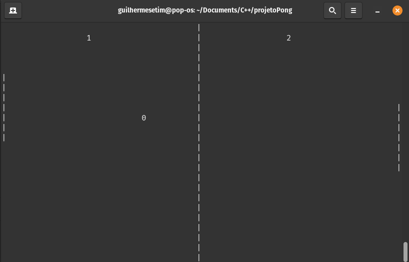

# Jogo *Pong* no terminal

# Sobre o projeto

O projeto busca reproduzir no terminal do computador, o clássico *Pong*, jogo eletrônico de esporte de arcade com temática de tênis de mesa, com gráficos bidimensionais.

## Layout do jogo
 

## Como jogar
- ⬆️ **Seta para cima:** para mover a paleta para cima.
- ⬇️ **Seta para baixo:** para mover a paleta para baixo.

## Tecnologias utilizadas
- C++

## Paradigma
- Programação Orietada ao Objeto

## Plataformas
- Unix (Linux);

# Como executar o projeto

## Requisitos
Instalar o compilador g++

# clonar repositório
`git clone https://github.com/guilhermesetim/pong-terminal.git`

# entrar na pasta do projeto pelo terminal
`cd pong-terminal/`

# compilar o projeto 
`make`

# executar o projeto
`make run`

# Autor

Guilherme Setim
